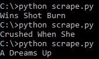

# Billboard Title Randomizer
> This is a small, probably very inefficient Python script that takes the titles of the songs in Billboard's Hot 100 and randomizes them to create new random song titles.

An interesting idea I had that was simple to create but useless for anything other than entertainment.

